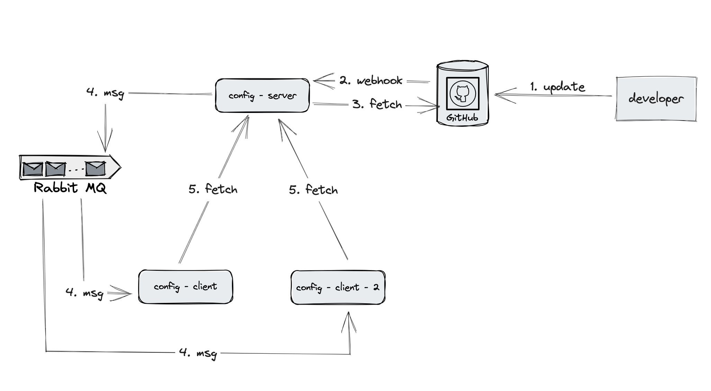
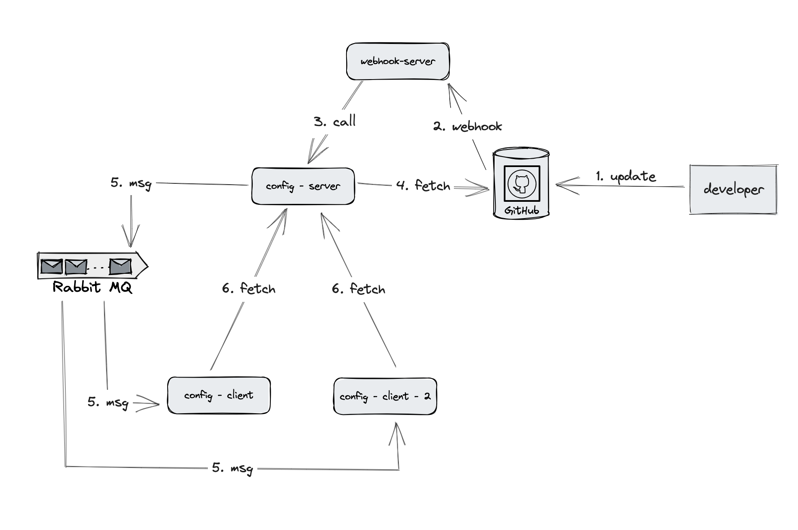
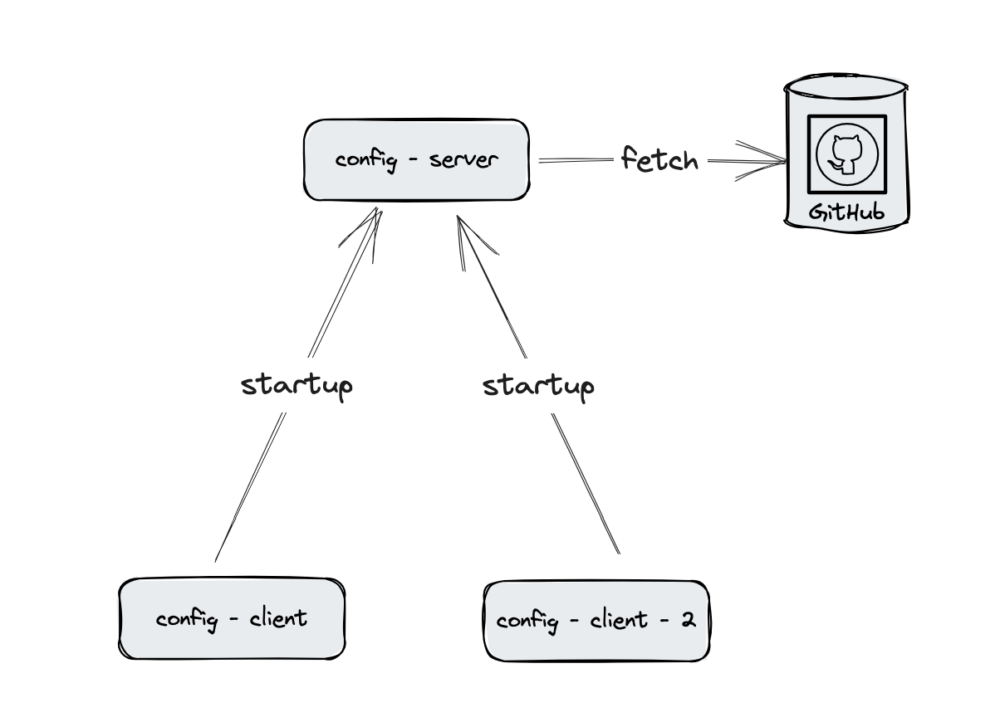
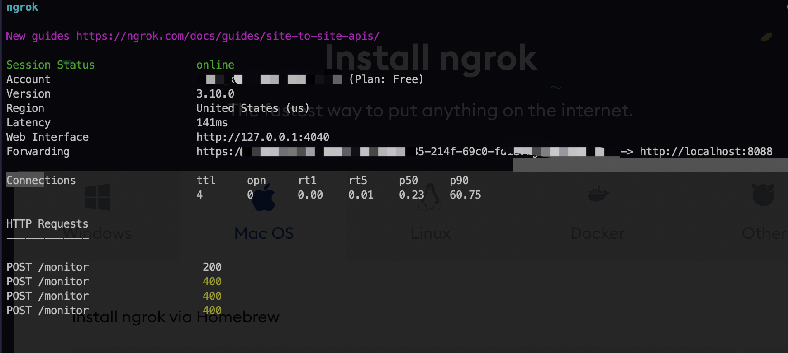
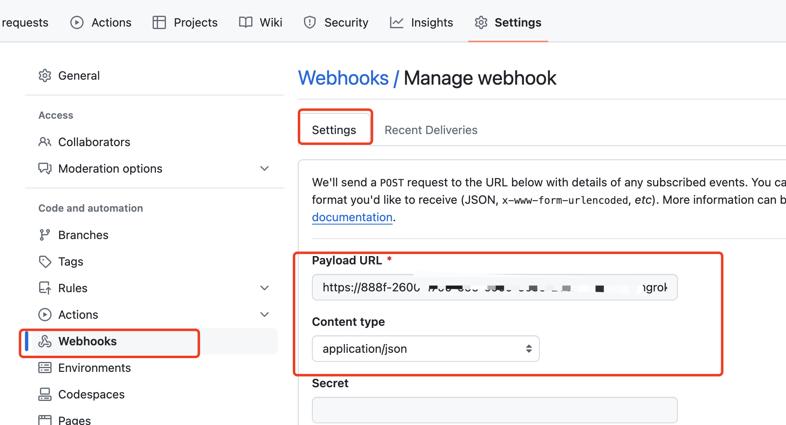

# Spring Cloud Config - Bus - Monitor Demo

This is a demo project of Spring Cloud Config with Spring Cloud Bus, Spring Cloud Monitor and Github Webhook


## Tech Stack

+ Spring Cloud Config
+ Spring Boot 3
+ Spring Actuator
+ Spring Cloud Bus
+ Spring Cloud Monitor
+ RabbitMQ
+ Docker
+ Github Webhook
+ Ngrok (exposing localhost to public)
+ Spring RestTemplate (Optional)

## Architecture/Workflow

### Exposing Config Server


### Exposing Webhook Server Instead of Config Server


### What happened at Startup Time


## Steps

Clone this project:
```
git clone https://github.com/KevinChung616/spring-cloud-config.git
```

run rabbit mq
```shell
docker run -d --name rabbitmq -p 5672:5672 -p 15672:15672 rabbitmq:3-management
```

Start Config Server, then visit `localhost:8080/client/default`. You should be able to get following response.
```json
{
  "name": "client",
  "profiles": [
    "default"
  ],
  "label": null,
  "version": "cdf4776a0bda28802ebc75df7bbdbc45652748cd",
  "state": null,
  "propertySources": [
    {
      "name": "https://github.com/KevinChung616/config-remote-repo.git/client.properties",
      "source": {
        "cnj.message": "jtsp"
      }
    }
  ]
}

```

Force refresh one client properties using Spring Actuator

```shell
curl --location --request POST 'http://localhost:8082/actuator/refresh'
```
> Note: ping the config client port

Force refresh clients properties using Spring Cloud Bus
```shell
curl --location --request POST 'http://localhost:8088/actuator/busrefresh'
```
> Note: ping the config server port
> 

---
**Use Spring Cloud Monitor to auto trigger**

1. expose your config-sever using: [ngrok](https://ngrok.com/download)
   
2. set up Github webhook to point to your config server `/monitor` endpoint
   
3. update the config values repo to test result.

---

**Use another dedicate webhook server**

Instead of exposing config server, we can start another spring boot application `webhook-server` and expose one endpoint as webhook url in github `<webhook-server>/webhook`

In the endpoint logic, we can use `restTemplate` to call internal config server end point `<config-server>/monitor`. 

If you want to skip `spring-cloud-monitor` dependency, you can also use `bus` only with endpoint `<config-server>/actuator/busrefresh`

```java
@SpringBootApplication
@RestController
@RefreshScope
public class Application {
    public static void main(String[] args) {
        SpringApplication.run(Application.class);
    }

    private final RestTemplate restTemplate = new RestTemplate();

    @PostMapping("/webhook")
    public String receiveWebhook(@RequestBody String payload) {

        // Create HttpHeaders and set the media type
        HttpHeaders headers = new HttpHeaders();
        headers.setContentType(MediaType.APPLICATION_JSON); // Set the desired media type here
        HttpEntity<Void> entity = new HttpEntity<>(null, headers);
        // Make a POST request with the desired media type
        String url = "http://localhost:8088/actuator/busrefresh"; // Replace with the actual endpoint URL
        restTemplate.exchange(url, HttpMethod.POST, entity, Void.class);
        return "Webhook received";
    }
}
```
